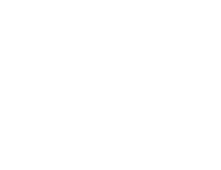

<!-- Improved compatibility of back to top link: See: https://github.com/othneildrew/Best-README-Template/pull/73 -->
<a name="readme-top"></a>


<!-- PROJECT LOGO -->
<br />
<div align="center">
  <a href="https://github.com/BeduTeam8/Recepini-V1">
    
  </a>

<h3 align="center">Recipini</h3>

  <p align="center">
    Recipini is a project created for Bedu FrontEnd Fundamentals Bootcamp 2022.
    <br />
</div>


<!-- TABLE OF CONTENTS -->
<details>
  <summary>Table of Contents</summary>
  <ol>
    <li>
      <a href="#about-the-project">About The Project</a>
      <ul>
        <li><a href="#built-with">Built With</a></li>
      </ul>
    </li>
    <li>
      <a href="#getting-started">Getting Started</a>
      <ul>
        <li><a href="#prerequisites">Prerequisites</a></li>
        <li><a href="#installation">Installation</a></li>
      </ul>
    </li>
    <li><a href="#usage">Usage</a></li>
    <li><a href="#roadmap">Roadmap</a></li>
    <li><a href="#contributing">Contributing</a></li>
    <li><a href="#license">License</a></li>
    <li><a href="#contact">Contact</a></li>
    <li><a href="#acknowledgments">Acknowledgments</a></li>
  </ol>
</details>


<!-- ABOUT THE PROJECT -->
## About The Project

This is a project about a recipes website named Recipini. This webpage is connected to https://www.themealdb.com/ API. 
Functionalities include:
* The user can look for recipes or specific ingredients with the search bar
* The user can select a recipe and access to its full instructions and required ingredients.
* The user can get a random recipe using the button "Random"

<p align="right">(<a href="#readme-top">back to top</a>)</p>


### Built With

* [![HTML][html.com]][html-url]
* [![CSS][css.com]][css-url]
* [![Bootstrap][Bootstrap.com]][Bootstrap-url]
* [![JavaScript][javascript.com]][JavaScript-url]
* [![Webpack][webpack.com]][webpack-url]
* [![SASS][sass.com]][sass-url]
* [![Figma][figma.com]][figma-url]

We used Figma to plan and configure the DesignSystem project. The basic structure was made using HTML, CSS, and Bootstrap.
SASS was included to generate and manipulate the stylesheets (variables, functions, inheritance). 
Finally, Webpack was utilized to produce a single document with the required modules.

<p align="right">(<a href="#readme-top">back to top</a>)</p>


<!-- GETTING STARTED -->
## Getting Started

To get a local copy up and running follow these simple example steps:

### Prerequisites

This is an example of how to list things you need to use the software and how to install them.
* npm
  ```sh
  npm install npm 
  ```
 to run dev server
* npm
  ```sh
  npm start 
  ```
  

<!-- ROADMAP -->
## Roadmap

- [ ] Meal DB API Conectivity
- [ ] UI 
- [ ] User Stories
    - [ ] Search a recipe
    - [ ] Random recipe
    - [ ] Navigate around the site

<p align="right">(<a href="#readme-top">back to top</a>)</p>
                                

<!-- MARKDOWN LINKS & IMAGES -->
<!-- https://www.markdownguide.org/basic-syntax/#reference-style-links -->
[contributors-shield]: https://img.shields.io/github/contributors/github_username/repo_name.svg?style=for-the-badge
[contributors-url]: https://github.com/github_username/repo_name/graphs/contributors
[forks-shield]: https://img.shields.io/github/forks/github_username/repo_name.svg?style=for-the-badge
[forks-url]: https://github.com/github_username/repo_name/network/members
[stars-shield]: https://img.shields.io/github/stars/github_username/repo_name.svg?style=for-the-badge
[stars-url]: https://github.com/github_username/repo_name/stargazers
[issues-shield]: https://img.shields.io/github/issues/github_username/repo_name.svg?style=for-the-badge
[issues-url]: https://github.com/github_username/repo_name/issues
[license-shield]: https://img.shields.io/github/license/github_username/repo_name.svg?style=for-the-badge
[license-url]: https://github.com/github_username/repo_name/blob/master/LICENSE.txt
[linkedin-shield]: https://img.shields.io/badge/-LinkedIn-black.svg?style=for-the-badge&logo=linkedin&colorB=555
[linkedin-url]: https://linkedin.com/in/linkedin_username
[product-screenshot]: images/screenshot.png
[html.com]: https://img.shields.io/badge/html5-%23E34F26.svg?style=for-the-badge&logo=html5&logoColor=white
[html-url]: https://html.com/
[css.com]: https://img.shields.io/badge/css3-%231572B6.svg?style=for-the-badge&logo=css3&logoColor=white
[css-url]: css.com
[Bootstrap.com]: https://img.shields.io/badge/Bootstrap-563D7C?style=for-the-badge&logo=bootstrap&logoColor=white
[Bootstrap-url]: https://getbootstrap.com
[javascript.com]: https://img.shields.io/badge/javascript-%23323330.svg?style=for-the-badge&logo=javascript&logoColor=%23F7DF1E
[javascript-url]: https://www.javascript.com/
[webpack.com]: https://img.shields.io/badge/webpack-%238DD6F9.svg?style=for-the-badge&logo=webpack&logoColor=black
[webpack-url]: https://webpack.js.org/
[sass.com]: https://img.shields.io/badge/SASS-hotpink.svg?style=for-the-badge&logo=SASS&logoColor=white
[sass-url]: https://sass-lang.com/
[figma.com]: https://img.shields.io/badge/figma-%23F24E1E.svg?style=for-the-badge&logo=figma&logoColor=white
[figma-url]: https://www.figma.com/
